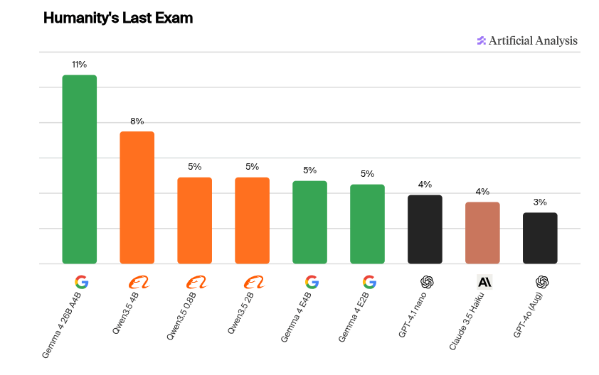
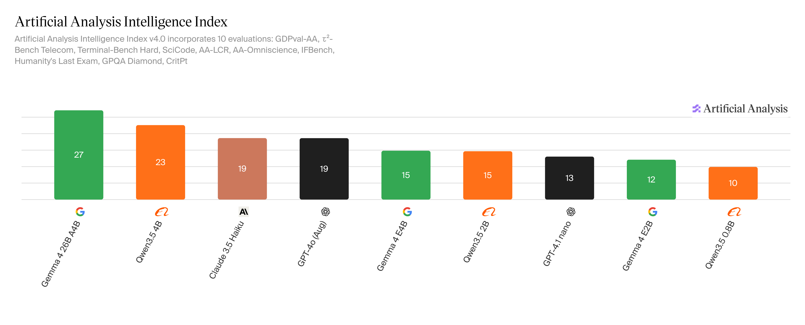
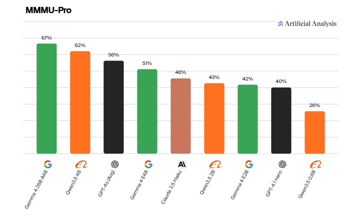
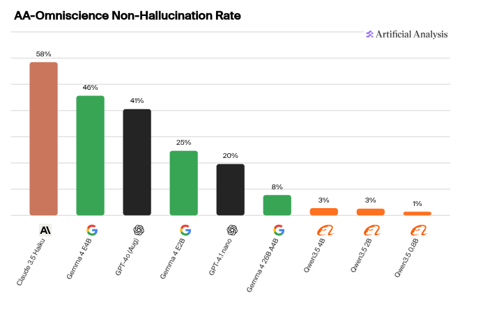
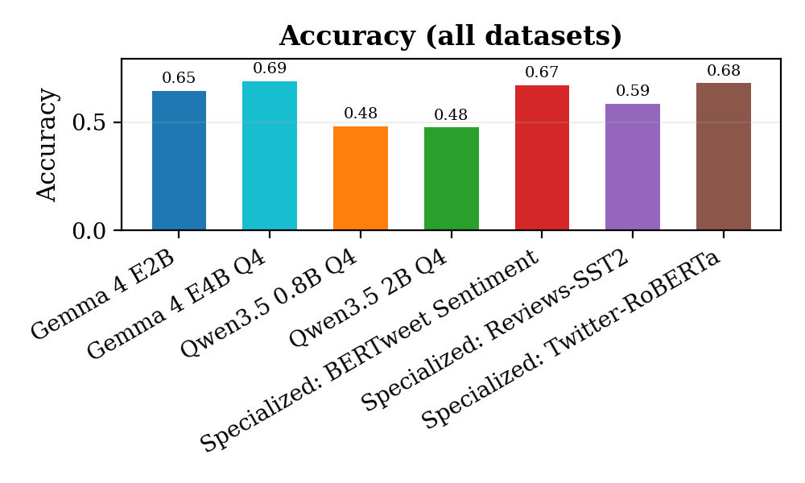
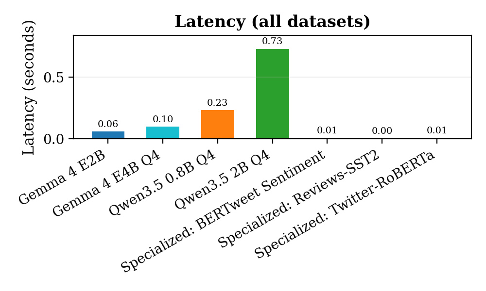
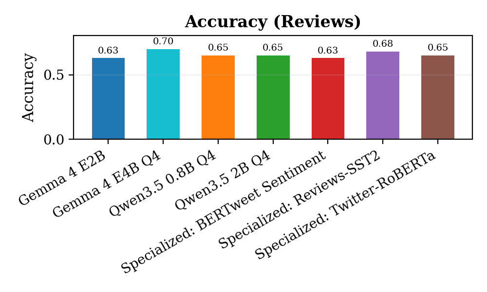
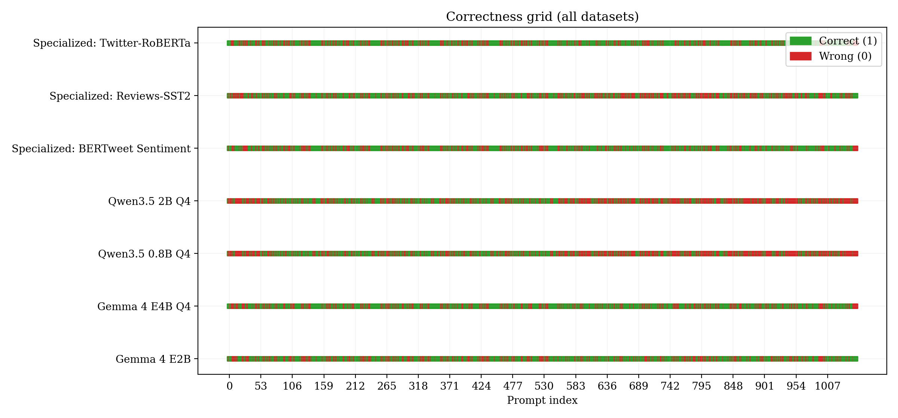
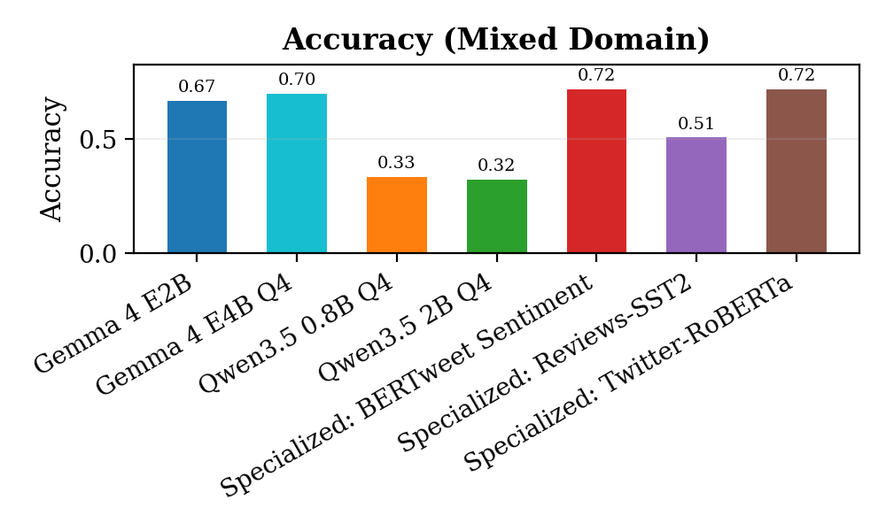
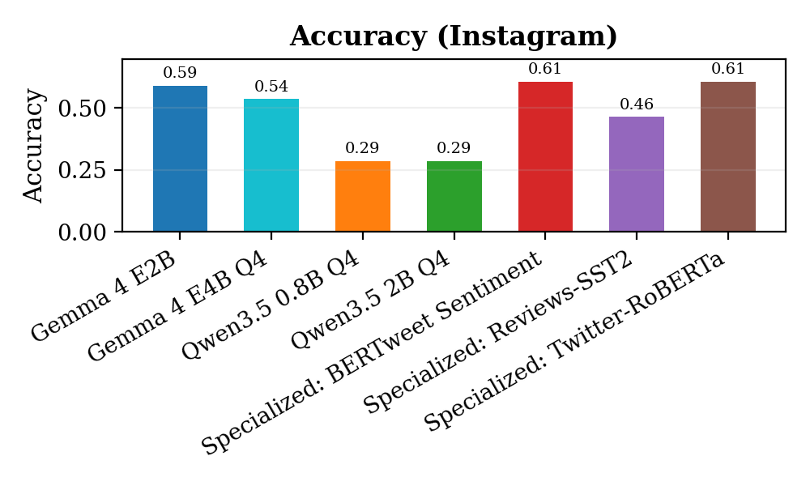

Sentiment Analysis
===

## Basic Task

- Take some input
- Classify its sentiment on some scale

<!-- pause -->

## Example

**Input**:
```
I do not like okra dipped in chocolate. Bad idea.
```
**Output**:
``` 
label: negative
confidence: 95% 
```

<!-- end_slide -->

Motivation for this project
===

## Prior experience with sentiment analysis

<!-- column_layout: [1, 2] -->
<!-- column: 0 -->

<!-- column: 1 -->

- ML.NET in 2018
- Following tutorials for Amazon Reviews dataset to train a classical Sentiment Analysis Model
- Used it to build a mini dialog for a video game that I never finished
<!-- reset_layout -->

<!-- pause -->
## Game

<!-- column_layout: [1, 1, 1] -->
<!--column: 0-->
```bash
$ dotnet run SentimentAnalysisGame
...
```
<!-- pause -->

```
A Wizard stops you and says, "How are you doing?"

What do you say?
> ...
```
<!-- column: 1 -->
<!-- pause -->

> the algorithm scores the sentiment on a scale from -1.0 (NEGATIVE) to 1.0 (POSITIVE)
```
> I feel rather sick

The wizard frowns. "I am sorry you feel that way"
```
<!--column: 2-->

<!-- pause -->
```csharp
var output = AnalyzeSentiment(userInput);
if (output.Score > 0){
  Wizard.Respond("I'm glad to hear it!");
}
else {
  Wizard.Respond("I am sorry you feel that way");
}
```

<!-- end_slide -->

# The Question

Is it worth it to use an LLM for sentiment analysis?

| Pros | Cons |
| -- | -- |
| Contextual Understanding | High compute costs |
| Richer outputs | More convoluted outputs |
| Complex Reasoning | Hallucinations |

<!-- pause -->

## Key tests for this project

- Testing accuracy vs compute cost
- Comparing lighweight LLMs with state-of-the-art specialized sentiment analysis models

<!-- pause -->


## The LLM that sparked the question

<!-- column_layout: [1, 2, 2] -->
<!-- column: 0 -->

<!-- column: 1 -->
### Google Gemma 4
- Large model with small amount of active parameters
- Can run on my Intel Laptop (no dedicated GPU)
- Performs better than GPT-4 on a lot of benchmarks
- Most papers use older models or much heavier, more expensive models.

<!-- pause -->
<!-- column: 2 -->


<!-- end_slide -->


<!-- column_layout: [1, 1] -->
<!-- column: 0 -->

<!-- column: 1 -->


<!-- end_slide -->


Methodology
===


- Pulled some sentiment analysis models from huggingface.
- Pulled some labelled datasets from Kaggle and huggingface across various domains (Social media, reviews, a mixed-domain dataset, ~1500 data points)
- Tested Gemma 4, Qwen 3.5, and two BERT-based models, and one SST model across various domains, comparing their outputs to the lavels in the dataset

<!-- end_slide -->

Results
===
<!-- column_layout: [1, 1] -->
<!--column: 0-->

<!--column: 1-->


<!--reset_layout-->
<!--pause-->

## Findings
- These small LLMs did not perform significantly better than specialized sentiment models
<!--pause-->
- In many cases, Gemma 4 did perform better, but in almost all cases Qwen 3.5 performed worse
<!--pause-->
- Even for small models, the latency of a traditional model for small data compared to the cost of running the small model makes the specialized model almost always the better choice, especially in domain-specific small-text situations.
<!--end_slide-->
## So what?

### From my testing
| LLM | Specialized Model |
|--|--|
| Better at question answering | Better for low latency simple classification |
| Gemma 4 is the better LLM for this  | The model specialized to its own domain performs better in its own domain |
| In some cases generalize better | In almost all cases specialize better |

<!-- end_slide -->
More results
===
<!-- column_layout: [1, 1] -->
<!--column: 0-->


<!--column: 1-->



<!-- end_slide -->
Limitations and Follow-Up
===

# Limitations

- Needs more benchmarking and testing to be definitive
- Needs to test more kinds of situations, more kinds of prompting
- Sentiment analysis with small context doesn't use the greatest strength of an LLM, which is contextual understanding.

<!-- pause -->
# Follow-up research


This experiment tested LLMs at zero-shot sentiment classification of small texts.

A natural follow up project would be to test them in situations like

- long text
- more nuanced sentiment extraction
- theme extraction

Also
- Test Gemma 4 26B A4B
- Fine-tune Gemma 4 for sentiment analysis and see results

<!--end_slide-->

```
 _______ _                 _                        
|__   __| |               | |                       
   | |  | |__   __ _ _ __ | | __  _   _  ___  _   _ 
   | |  | '_ \ / _` | '_ \| |/ / | | | |/ _ \| | | |
   | |  | | | | (_| | | | |   <  | |_| | (_) | |_| |
   |_|  |_| |_|\__,_|_| |_|_|\_\  \__, |\___/ \__,_|
                                   __/ |            
                                  |___/             
```
